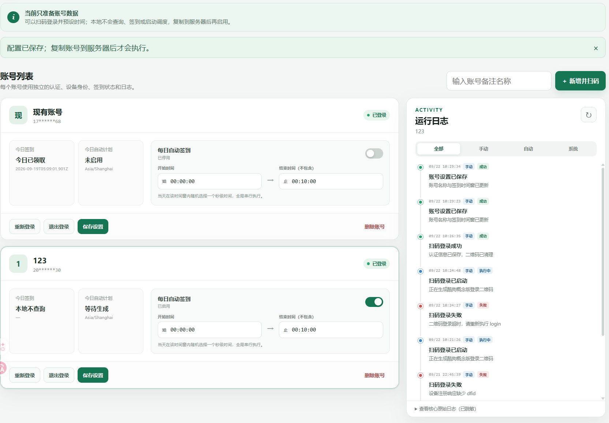
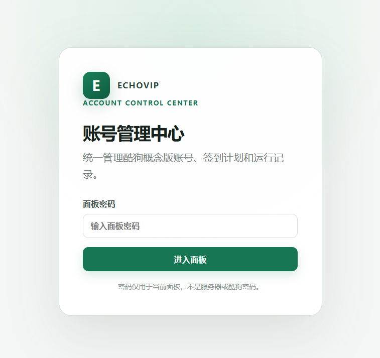

# EchoVIP Headless

EchoVIP 是面向酷狗概念版的低频、固定设备身份、当天 VIP 领取工具。项目同时保留原有单账号无界面 CLI，并新增多账号 Web 控制层；Web 层只负责账号隔离和任务编排，真正的登录、状态查询、Token 处理、风控判断和领取仍由原 CLI 完成。

当前冻结核心已经通过真实扫码、Token 验证、月度记录、重复领取保护、Docker 和服务器自动领取验证。控制层不得直接请求酷狗接口，也不得绕过验证码或风控。

## 项目来源与改造关系

本项目的主要上游是 [MakcRe/KuGouMusicApi](https://github.com/MakcRe/KuGouMusicApi)。二维码登录、请求签名、概念版参数、Token 刷新、设备注册、每日 VIP 领取和月度领取记录等协议实现，均在该项目公开实现的基础上筛选、移植并重构。感谢原作者 MakcRe 对酷狗音乐 API 的整理和开源；对应版权与 MIT 许可全文见 [LICENSE-NOTICE.md](LICENSE-NOTICE.md)。

开发过程中还参考了 [hoowhoami/EchoMusic](https://github.com/hoowhoami/EchoMusic) 对 KuGouMusicApi 的调用边界以及登录态、设备字段的持久化思路，但没有复制 EchoMusic 的 Electron、Vue、播放器、Rust 模块或其他源文件。本项目不是 EchoMusic 的精简版或服务端版本。

相较 KuGouMusicApi，本项目并非提供完整音乐 API，而是针对每日领取场景进行了以下改造：

- 删除与每日 VIP 领取无关的音乐搜索、播放、歌单等接口，只保留必要的登录、状态、设备和领取流程。
- 将原接口服务整理为可直接运行的无 GUI CLI，固定并持久化设备身份，避免每天生成新设备。
- 加入领取前远端月记录复核、本地幂等状态、有限重试、风控停止和敏感日志脱敏。
- 增加多账号 Web 管理、本地二维码准备模式、服务器随机调度、全局串行锁和账号隔离。
- 增加 Docker、可选反向代理、源码隐私检查、自动测试和可回退的服务器部署方式。

## 为什么进行魔改

这个项目面向一种具体使用场景：用户有一台可以长期运行的服务器，同时希望手机继续使用安卓最新版酷狗概念版。旧版 2.5.5 在部分较新的安卓系统上存在兼容问题，尤其是 Android 12 及以上设备可能无法正常使用；而 2.5.5 之后的版本需要在手机端观看广告才能领取当天 VIP，因此只保留旧版应用或每天手动操作都不够方便。

本项目把账号本人每天可领取的权益放到服务器上按低频、固定设备身份自动执行。服务器领取成功后，权益记录在同一酷狗账号下，手机继续使用最新版酷狗概念版即可获得当天 VIP，无需再在手机端执行领取操作。它不提供永久会员、批量领取、未来日期领取、验证码绕过或风控规避；酷狗接口和平台规则发生变化时，使用者仍需自行评估风险并遵守平台条款。

## 快速安装

本地准备账号需要 Node.js 22 及以上版本；服务器自动运行需要 Linux、Docker Engine、Docker Compose v2 和 Cron。域名与反向代理都不是必需项。

### 1. 下载项目

```bash
git clone https://github.com/moos1110/EchoVIP-Headless.git
cd EchoVIP-Headless
```

也可以在 GitHub 下载源码压缩包，解压后进入项目目录。

### 2. 选择一种运行方式

- 只想在本地扫码并把账号数据交给服务器：按下方“方式一”操作，本地安装 Node.js 依赖，服务器只构建镜像并安装调度任务。
- 希望随时远程管理账号：按下方“方式二”操作，服务器启动 Web 面板，可使用 `IP:端口`，也可交给任意反向代理绑定域名。

`docker-compose.yml` 虽然定义了四个服务，但默认 `docker compose up -d` 只会启动 `echovip-web` 一个常驻容器。`echovip`、`echovip-scheduler` 和 `echovip-admin` 是登录、调度与迁移所需的按需命令，不会随默认启动常驻运行。

## 两种主要使用方式

| 使用场景 | 本地准备账号后部署 | 服务器远程管理 |
| --- | --- | --- |
| 扫码登录位置 | 自己的电脑浏览器 | 服务器 Web 面板 |
| 账号数据 | 本地生成后逐个复制到服务器 | 直接保存在服务器账号目录 |
| 远程管理 | 不开放公网面板 | 支持账号、状态、日志和签到管理 |
| 每日自动领取 | 由服务器调度器执行 | 由服务器调度器执行 |
| 域名与反向代理 | 不需要 | 可选，可直接使用 IP + 端口 |

### 方式一：无域名，本地准备账号后部署到服务器

在自己的 Windows 电脑运行 `provisioning` 面板，通过浏览器完成二维码登录、账号备注和签到时间设置。本地模式不会查询签到状态、领取 VIP 或启动调度，只负责生成每个账号独立的 `accounts/<UUID>` 数据目录。



```powershell
git clone https://github.com/moos1110/EchoVIP-Headless.git
Set-Location ".\EchoVIP-Headless"
Copy-Item -LiteralPath ".env.example" -Destination ".env"
[Convert]::ToHexString([Security.Cryptography.RandomNumberGenerator]::GetBytes(32)).ToLower()
# 用记事本编辑 .env：保持 APP_MODE=provisioning，填写 PANEL_PASSWORD，
# 并把上一行生成的随机字符串填入 SESSION_SECRET。
npm ci
npm run build
npm run web
Start-Process "http://127.0.0.1:8787"
```

二维码会同时显示在浏览器，并临时写入 `accounts/<UUID>/runtime/login-qr.png`；成功、取消或超时后自动删除。准备完成后，按“本地账号复制到服务器”一节上传单个账号目录。服务器执行以下命令构建镜像并安装调度器，不必启动 Web 面板：

```bash
docker compose build
chmod +x scripts/run-scheduler-tick.sh scripts/install-multi-account-cron.sh
./scripts/install-multi-account-cron.sh
```

### 方式二：服务器远程管理（IP + 端口或域名）

在服务器以 `server` 模式运行面板后，可以远程新增或删除账号、扫码登录、退出或重新登录、刷新状态、手动签到、启停自动签到、调整时间窗，并查看每次手动操作和自动任务的脱敏日志。



先准备配置并启动：

```bash
cp .env.example .env
openssl rand -hex 32
# 编辑 .env：设置 APP_MODE=server、PANEL_PASSWORD 和 SESSION_SECRET；
# SESSION_SECRET 使用上一行生成的随机字符串。
docker compose up -d --build
```

直接使用服务器 IP 和端口时，在 `.env` 中设置：

```env
APP_MODE=server
WEB_PUBLISH_HOST=0.0.0.0
WEB_PUBLISH_PORT=8787
PUBLIC_BASE_URL=http://<服务器IP>:8787
PANEL_PASSWORD=由用户自行设置的面板密码
SESSION_SECRET=至少32字符的独立随机字符串
SECURE_COOKIES=false
```

然后访问 `http://服务器IP:8787`。这种 HTTP 方式适合可信局域网、VPN 或临时测试；还应使用服务器防火墙限制来源。若要长期暴露在公网，建议启用 HTTPS。

使用域名和反向代理时，在 `.env` 中设置：

```env
APP_MODE=server
WEB_PUBLISH_HOST=127.0.0.1
WEB_PUBLISH_PORT=8787
PANEL_DOMAIN=vip.example.com
PUBLIC_BASE_URL=https://vip.example.com
PANEL_PASSWORD=由用户自行设置的面板密码
SESSION_SECRET=至少32字符的独立随机字符串
SECURE_COOKIES=true
```

反向代理只需转发到 `http://127.0.0.1:8787`，可以使用 Nginx、Caddy、Traefik 或现有面板，不限定具体软件。仓库中的 Nginx 模板只是可选示例；填写 `PANEL_DOMAIN` 后执行 `npm run nginx:render` 可生成 `deploy/nginx-echovip.conf`。`.env` 和生成的配置都不会进入 Git 或源码发布包。

### 补充方式：原单账号 CLI

不需要多账号管理时，可以继续使用原有单账号命令和 `data/` 目录：

```bash
npm run login
npm run status
npm run claim
npm run refresh
npm run logout
```

Docker 等价命令：

```bash
docker compose run --rm echovip login
docker compose run --rm echovip status
docker compose run --rm -T echovip claim
docker compose run --rm echovip refresh
docker compose run --rm echovip logout
```

## 多账号数据结构

每个账号均可独立复制：

```text
accounts/<UUID>/
├── account.json
├── runtime/
│   ├── auth.json
│   ├── device.json
│   ├── state.json
│   ├── scheduler.json
│   └── login-qr.png     # 仅扫码期间存在
└── logs/
    └── operations.jsonl # 面板手动操作与自动任务的结构化结果
```

`runtime` 被原 CLI 当作该账号的 `DATA_DIR`，不会转换认证或设备文件。账号退出登录时只清除 `auth.json` 并停用计划；彻底删除改用面板内确认框并要求输入账号名称，确认后移除整个账号目录。右侧日志区持续记录扫码、配置保存、状态刷新、手动签到及自动调度的时间、来源、状态和脱敏结果。

## 迁移现有单账号

先构建项目，然后复制旧 `data` 为首个多账号目录。源目录不会移动或覆盖：

```bash
npm run build
npm run account:migrate -- ./data 现有账号
```

验证新目录后再切换定时任务。旧 `data/` 必须保留到新版完成至少一次真实自动领取验收。

## 本地账号复制到服务器

只复制需要同步的单个 UUID 目录，不复制 `.env`。下面的 `~/apps/echovip-headless` 是普通用户目录下的推荐位置，并非固定要求；如果项目部署在其他位置，同时修改 `$RemoteProjectDir` 和服务器端的 `ECHOVIP_DIR` 即可。

```powershell
$Server = "<ssh-user>@<server-host>"          # 例如 deploy@example.com，也可以填写服务器 IP
$RemoteProjectDir = "~/apps/echovip-headless" # 改成服务器上的实际项目目录
$AccountId = "<UUID>"                         # 改成 accounts 下需要上传的目录名

ssh $Server "mkdir -p $RemoteProjectDir/incoming"
scp -r ".\accounts\$AccountId" "${Server}:${RemoteProjectDir}/incoming/"
```

服务器执行结构校验、重复用户检查、权限收紧和原子接入：

```bash
export ECHOVIP_DIR="$HOME/apps/echovip-headless" # 改成项目的实际部署目录
export ACCOUNT_ID="<UUID>"                       # 与本地上传的账号目录名一致
cd "$ECHOVIP_DIR"
docker compose run --rm -T echovip-admin adopt "/app/incoming/$ACCOUNT_ID"
```

这里的 `/app/incoming` 是 `docker-compose.yml` 定义的容器内部路径，不是服务器主机目录，因此保持不变。不要用普通网盘或未加密压缩包传输账号目录，只通过 SSH/SCP。面板密码和会话密钥不随账号目录复制。

## 每账号随机签到

- 默认时间窗为 `00:00:00–00:10:00`，即随机秒数范围 `0–599`。
- 每个账号独立生成当天计划，开始时间包含、结束时间不包含；允许 `24:00` 作为结束时间，不允许跨日。
- 所有领取任务全局串行；账号内部仍保留原有 `claim.lock`。
- 服务器错过计划时间后，当天恢复会补执行一次；不会补执行往日任务。
- 手动签到已成功时，当天自动计划直接标记完成。
- 登录失效、Token 无法恢复或风控退出码会自动停用该账号计划。
- 服务器模式修改时间窗从次日生效；本地准备模式只保存配置。

安装新的每分钟调度前，必须先移除旧的单账号随机 Cron，避免两套任务同时运行：

```bash
chmod +x scripts/run-scheduler-tick.sh scripts/install-multi-account-cron.sh
./scripts/install-multi-account-cron.sh
```

Cron 每分钟只执行本地计划检查，只有账号到达随机秒数时才调用冻结核心的 `claim`。

## 面板安全

- `PANEL_PASSWORD` 是项目自己的密码，不是 Linux、SSH 或云服务器密码；项目没有默认密码。
- `SESSION_SECRET` 至少 32 字符；面向公网长期开放时必须通过 HTTPS 访问并启用 `SECURE_COOKIES=true`。
- 登录接口限速，会话使用签名的 HttpOnly、SameSite Cookie，写操作同时校验 Origin 和 CSRF Token。
- API 不返回 Token、Cookie、二维码原始链接或完整设备标识；日志读取前再次脱敏。
- `.env`、`accounts/`、`control-data/`、二维码、日志和发布压缩包均被 Git 排除。

## 分享源码

发布前执行：

```powershell
npm run privacy:check
pwsh -File ".\scripts\create-source-release.ps1"
```

发布脚本仅打包 Git 已跟踪的项目文件，并在生成前检查敏感路径。不要直接压缩整个工作目录。

## 许可证

本项目采用 [PolyForm Noncommercial License 1.0.0](LICENSE)，允许个人学习、研究、测试、非商业组织使用以及非商业目的的修改和分发，**不允许商业使用**。这是一份源码可用的非商业许可证，不属于 OSI 认可的开源许可证。

项目包含或改写自第三方 MIT 许可项目的部分实现，相关版权声明和完整许可文本见 [LICENSE-NOTICE.md](LICENSE-NOTICE.md)。第三方代码仍按其原许可证授权。

## 原理与风险边界

设备身份首次生成后持续复用。每日领取先检查本地成功记录，再查询酷狗远程月度记录；只有远端确认尚未领取时才发出当天领取请求。请求结果不明确时写入 `UNCONFIRMED`，后续只核验而不重复领取；命中安全验证时立即停止，不破解验证码、不轮换代理、不批量领取未来日期。

原始接口、概念版参数、风控策略、日志脱敏和上游差异见 `UPSTREAM.md` 与 `LICENSE-NOTICE.md`。本项目仅供账号本人执行正常、低频操作，使用者应遵守平台条款并承担接口变化或账号验证风险。

## 开发与验收

```bash
npm install
npm test
npm run build
npm run privacy:check
docker compose build
docker compose run --rm echovip --help
```

测试覆盖冻结核心、账号隔离、重复用户、调度随机范围、停机补签、手动成功跳过、密码会话、CSRF、本地模式权限和子进程目录隔离。运行镜像不包含 Electron、Chromium、X11、Xvfb、FFmpeg 或音频组件。

## 友情链接

- [LINUX DO 社区](https://linux.do/)——新的理想型社区。
- [LINUX DO 开源推广说明](https://linux.do/t/topic/1776670)
